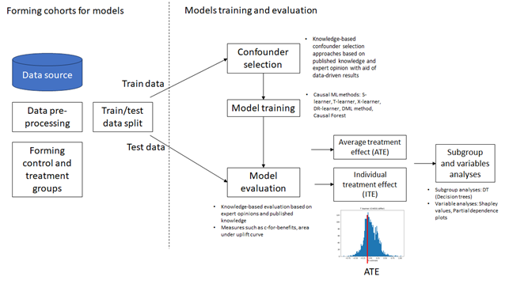

# Description of analysis data set used with MS21

## General information

**M21 Trained ML algorithms on pharmacological treatment**

### Responsible consortium partner

NHG

### Contact person

Mikko Nuutinen (email: [mikko.nuutinen@nhg.fi](mailto:mikko.nuutinen@nhg.fi)); *affiliations*: Nordic Healthcare Group, Helsinki, Finland

### Short description of data contents, analysis purpose, and methods

Multi-database cohort study using clinical assessment data routinely collected from Finland. Main goal was to develop model training pipeline of causal machine learning models containing the processes of forming training data and model training and evaluations and to demonstrate the results of trained models. The data sources for the model training pipeline were RAI-HC (Resident Assessment Instrument for Home Care) and RAI-LTC (Long Term Care) assessments (MDS 2.0 instruments) and the Finnish Care Register for Health Care. The data were collected from the years 2014-2020. The data were processed from the source files into RAI variables, hospital and emergency care visits, RAI scales, and medication data. RAI variables refer to quantitative variables obtained directly from the RAI assessment instrument. Hospital and emergency care visits and medication data were obtained from the Finnish Care Register for Health Care.

### Sample size

#### Finland

- LTCF: n=53513
- HC: n=77311
- Time windows of recruitment: 01/01/2014 – 31/12/2020

## Data processing

### Sample restrictions

Individuals aged 65 years or older were included, with at least one assessment record within trunked time window.

### Major re-codings or transformations applied

- N/A

### How missing values were handled

If background information was missing (gender, BMI and age), the client was excluded from the study. If more than 10% of variables (confounders) was missing, the client was excluded from the study. For other binary variables [0, 1], where missing values were judged to mean no positivity (e.g., no pain, no memory problem), the values were replaced with 0. For continuous or categorical ordinal variables missing values or outliers were replaced by the nearest neighbors imputation method.

### Short description of the methods used in each analysis phase

Figure 1 summarizes the framework for training causal machine learning models for estimating individual treatment effects. The steps are data pre-processing (step 1), forming control and treatment groups (step 2), and model training and evaluating (step 3). The detailed description of each task can be found from the MS21 report.

**Figure 1.** The main parts of model developing pipeline in this study are data pre-processing, forming control and treatment groups and model training and evaluation.

### Countries whose data were used and contact person for each country

#### Finland

Jokke Häsä (jokke.hasa@thl.fi)

## Data contents

### General description of the data contents

Variables selected for model training (confounders) were based on the domain knowledge with the aid of data-driven approach. Data-driven approach searches candidate confounders by the univariate models that were trained for predicting treatment or outcome. The domain experts were professionals in clinical geriatrics and pharmacology. They use the data-driven results as a candidate list of potential confounders, but the final confounder selection was based on expert opinions.

### List of variables using harmonised names and short descriptions

#### RAI-MDS HC

- **ABS**: ABS
- **ADLH_4**: ADLH > 3
- **anticoagulant_temp**: Anticoagulants
- **atc_analgesics**: Analgesics
- **atc_antidepressants_SSRI_v2**: Antidepressants
- **atc_antipsychotics**: Antipsychotics
- **atc_antithrombotic_agents**: Antithrombotic agents
- **atc_cardiac_therapy**: Cardiac therapy
- **atc_diuretics**: Diuretics
- **atc_hypnotics_and_sedatives**: Hypno-sedative medications
- **BB1**: Gender
- **CPS_3**: CPS > 3
- **DRS_3**: DRS > 3
- **E1B_3cat**: Persistent anger with self or others (3 cat)
- **E1I_3cat**: Reduced social interaction
- **F2**: Change in social activities
- **H2C_6cat**: Locomotion in home (6cat)
- **H2G_6cat**: Eating (6cat)
- **H3**: ADL status has become worse
- **H4A**: Primary modes of locomotion - Indoors
- **H6B**: Hours of physical activities in the last 3 days
- **hilmo_er_visits_last6months**: ER visits last 6 months (HILMO)
- **hilmo_hospital_visits_last6months**: Hospital visits
- **IKA**: Age
- **J1E**: Irregular pulse
- **J1S**: Any psychiatric diagnosis
- **K3C**: Dizziness or lightheadedness
- **K5**: Number of times fell in last 90 days
- **K6A**: Unsteady gait
- **K8A**: Client feels he/she has poor health
- **MMC_alzheimer_dementia**: MMC Alzheimer dementia
- **MMC_cardio_respiratory**: MMC Cardio_respiratory
- **MMC_cerebrovascular**: MMC Cerebrovascular
- **MMC_non_alzheimer_dementia**: MMC Non-alzheimer dementia
- **MMC_psychiatric**: MMC Psychiatric
- **neurological_diagnosis**: Neurological diagnosis
- **numberOfComorbidities**: Number of comorbidities
- **numberOfMeds**: Number of drugs
- **pain_scale**: Pain scale
- **painmed_or_analgesics**: Pain medications or analgesics
- **painmed_temp**: Pain medications
- **problems_because_of_drinking**: Problems because of drinking
- **psychotropic_temp**: Psychotropic medications
- **SADLH_hc**: ADL hierarchy
- **SADLLF_hc**: ADL Long
- **sBMI_hc**: BMI
- **SCHESS_hc**: CHESS
- **SDRS_hc**: DRS
- **unplanned_hospital_ER_visit**: Unplanned hospital or ER visit
- **unsteady_gait_or_falls**: Unsteady gait or falls

#### RAI-MDS LTC

- **IKA_ltc**: Age
- **AA3__**: Gender
- **sBMI_ltc**: BMI
- **numberOfMeds_ltc**: Number of drugs
- **numberOfComorbidities**: Number of comorbidities
- **SCPS_ltc**: CPS
- **SADLH_ltc**: ADLH
- **SDRS_ltc**: DRS
- **ABS**: ABS
- **delirium**: Delirium scale
- **psychotic_symptoms**: Delusions OR hallucinations
- **J1_N**: Unsteady gait
- **acute_episode_monitoring_acute_condition**: Flare-up or monitoring of acute condition
- **hospital_er_last6months**: Hospital or ER visits (last 6 months)
- **Chemotherapy_or_end_stage_disease**: Chemotherapy or end stage disease
- **K1_D**: No mouth problems
- **any_restrains_used**: Any restrains used
- **Physician_visits_doctors_orders_changed_abnormal_labs**: Physician visits, doctors orders changed or abnormal labs
- **SCPS_ltc**: CPS
- **B4__**: Cognitive skills for making every day decisions
- **SADLLF_ltc**: ADLLF
- **B3_A**: Memory recall - current season
- **sBMI_ltc**: BMI
- **B3_D**: Memory recall - that he / she is in a facility
- **IKA_ltc**: Age
- **SCHESS_ltc**: CHESS
- **B6__**: Resident cognitive status, skills or abilities have changed
- **numberOfMeds_ltc**: Number of drugs
- **G1HA_**: Self performance - eating
- **I1_Q**: Alzheimer
- **G1GA_**: Self performance - dressing
- **I1_S**: Cerebral palsy
- **E4AA_**: Wandering - density
- **SADLH_ltc**: ADLH
- **J4_A**: Fell in past 30 days
- **B3_B**: Memory recall - location of own room
- **SDRS_ltc**: DRS
- **E4CA_**: Physically abusive symptoms - density
- **B3_C**: Memory recall - staff names / faces
- **E4BB_**: Verbally abusive symptoms - change
- **G1IA_**: Self performance - toilet
- **J1_N**: Unsteady gait
- **SCHESS_ltc**: SCHESS_ltc
- **G1HA_**: G1HA_
- **SADLLF_ltc**: SADLLF_ltc
- **atc_memory_N06D_ltc**: atc_memory_N06D_ltc

### Data sources for each country

- **Finland**: MDS-HC and MDS-LTC instruments are used. Information on medication, diagnosis, and hospital discharge including deaths are retrieved from the Hospital discharge register (Hilmo).

## Publications

No publication yet.
